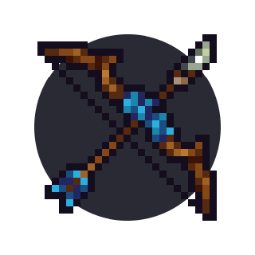

# Archer I: Basics

  

## The archer class

There are three classes in KAG: the archer, the builder and the knight. While the archer isn't as strong as the knight class, it's probably the most fun class to play in TDM and is very viable support in CTF if played well. Good archers can also play aggressively and get as many kills as knights. A good team in Capture The Flag (CTF) or Take The Halls (TTH) should have at least 2-3 archers (if your team isn't lacking knights, of course).

As an archer in CTF and TTH, your role is to support your team by being an annoyance to enemy knights or using special arrows, but before we get to that part, let's talk about the combat mechanics first.

## Mechanics

As an archer, you have a bow with a limited amount of arrows and a grappling hook which gives archers superior mobility.

### Full shot

Charging a bow to do what is known as a 'full shot' takes a full second (30 ticks). Just watch your cursor to know when you can release your mouse button to do a fullshot.

[GIF 1 - shoot someone with a fullshot]

A fullshot deals 1 heart of damage. and stuns the enemy for a short while if done in a close distance (even if it's a shielding knight).

[GIF 2 - fullshot stun on shield, fullshot stun without shield, fullshot no stun]

You can't stun the enemy by shooting them if they're 6 or more blocks away.

### Half shot

Half shot requires charging for slightly more than half of the cursor - first red dot, as seen in the gif below.

[GIF 3 - shoot half shots at people]

[GIF 3.2]

They don't stun like full shots, and have a lower velocity, but they do the same amount of damage - 1 heart. You should use them the most at mid-range fights and when supporting your knights - they're the most useful shots most of the time.

Keep in mind that if you shoot a half shot and it hits the enemy that was a bit more far away, it may lose velocity and do 0.5 heart of damage instead.

[GIF 4 - 0.5 heart]

There are also certain situations where a half shot can hit someone when a full shot wouldn't (arc shots).

[GIF 5]

### Quarter shot

A quarter shot is the quickest shot. You need to charge it for only a short while (1/3 of a second) - you can release when the cursor reaches the first red dot. It does 0.5 heart of damage.

[GIF 6]

If the arrow has time to gain velocity and you have significant height advantage, it can also do 1 heart of damage. It's a good tactic to spam quarter shots from your tower when there are lots of enemies below.

[GIF 7]

### Triple shot

Triple shot is the strongest attack. Requires charging for 2 seconds and shoots 3 arrows. The top and bottom arrows decay after a second or so, while the middle one has the velocity of a full charged shot and does not decay.

[gif here]

It can kill archers or builders instantly if all the arrows hit.

[gifs here]

Stomping and shooting knights with triple shot can instakill them if the stomp damages them.

[gifs here]

It's also a good way to get players knocked off a tower or into your teams knights/mine.

[gifs here]

Triple shot accelerates kegs like a waterbomb would.

[gifs here]

This works both ways, you can instantly explode an enemy keg aswell.

[gifs here]
[gif with knight holding keg aswell]

### Grappling

The grappling hook gives archer the most mobility out of all three classes, making archer the most mobile class in combat situations. It can give you speed that can be used in many situations, like stealing the flag, someones dropped items, climbing a tower and harassing the enemy builder, etc.

[GIF 11]

The grappling hook relies on momentum, meaning the more momentum you have, the faster you will go forwards, this is why spamming your grapple to climb the enemy wall will be more of a disadvantage than advantage. Proper way to climb is shown below.
 
[GIF 12]

The mobility yo uhave thanks to the grappling hook is a major reason why archer is the most fun class to play for some. 

### Stomping

You can stomp people by falling on top of them, which stuns them and does damage depending on your velocity (1 heart or 2 hearts). The grappling hook helps you to gain velocity you wouldn't have by normally jumping, this gets nullified at bigger fall distances as you will not have time to grapple down at the ground to get that extra momentum, because the grapple falls slower than yourself. You can also grapple to a wall/tower/tree while stomping someone so you dont completely touch the ground and you are safe from other enemy knights, this can also give you momentum to immediately get back up.

[GIF 13 - 1 heart stomp no shield]

[GIF 14 - 2 heart stomp no shield]

[GIF 15 - gif of stomp and grapple to tree]

[need gifs with failed stomps aswell]

If you want to stomp a knight that has his shield up, you need to stomp with a higher velocity.

Stomping is a good mechanic to get rid of enemy builders or archers that get too close to your base. 

[GIF 16]

Stomping is a good way to gain extra damage in TDM aswell, as the combat is much more compact than in CTF. 

## Mobility

Mobility is the most important aspect of playing against other players, the better you become at it, the easier it is to surprise enemies, as well as baiting/tricking other players so they expose theirselves and you can get a free shot on them. Using the grappling hook is a must.

## Items

Archer has three special arrow types - water arrow, fire arrow and bomb arrow.
Each arrow supports a different role. 

### Water arrows

Water arrows can extinguish fires or stun enemies for a while to gain extra time or make enemies defenseless against your teammates.

[GIF 17 stun]

Keep in mind that the stun lasts less if the enemy had their shield up or is practically unexistant if they had a sponge in inventory.

[GIF 18 - shield up]

[gif 19 - sponge]

A good tactic when playing against a defensive player when you have water is to stun him and then quickly half shot him before he gets unstunned and can react.

[gif 20]

### Fire arrows

Fire arrows can burn wooden structures or enemy players to make them run towards their cursors' direction. 

[GIF 21 - burning wooden structures]

[GIF 22 - burning player]

Fire arrows shot at enemy kegs will make them catch fire which will ignite them, and it can be extinguished with a water bucket only, so be careful if your team has kegs stored up. This also happens if wooden background or wooden blocks next to the kegs start burning.

[gif 23 - lighting enemy keg]

### Bomb arrows

Bomb arrows can do significant damage on impact, 3 hearts of damage at most. Perfect for killing enemy builders while they're rushing towards your base. They're also very good to be used against enemy structures as they will destroy 3 blocks facing opposite of the bomb arrows tip, they also do have some area of damage around the impact, which can break backwalls, which makes them excellent at collapsing enemy towers and opening enemy flagrooms, although they obviously don't hit backwalls themselves. 

[GIF 24 - bomb arrow enemy builder]

[GIF 25 - bomb arrow flag room]

[GIF 26 - bomb arrow collapse]

## Learning & playing as a beginner

What you should focus on learning as a beginner is the various shots, mobility and aim. You should charge triple, full and half shots as fast as possible - in some cases, being faster than your opponent is what will decide the outcome of an archer duel. You should also be able to move freely around the map with your grappling hook, as well as during combat. Being able to aim (while doing various shots) is also what you should focus on at this level.
