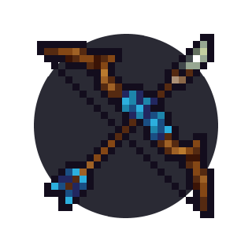

# Archer II: Getting better

  

## Max zoom vs middle zoom, fixed camera vs unfixed

There are 3 main types of zoom in kag -- max zoom in, middle zoom and max zoom out. The first one is almost always bad and you shouldn't use it. Most archers decide to mostly use middle zoom in mid and close-range and then swap to max zoom out in long-range fights. However, to some aiming may be confusing if they swap the zooms often, so some stick to max zoom out, even on mid-range and close-range fights. Both have their pros and cons and it's up to each individual to decide what they prefer. It's also dependent on what camera they decide to use.

You can also use the zoom levels in-between middle and max zoom out -- to use one of them, hold CTRL while scrolling in or out.

There are 2 kinds of cameras in KAG - unfixed camera and fixed (this can be changed in settings). With fixed camera, your character is always in the center of the screen; with unfixed camera, the camera follows your mouse on middle zoom. Unfixed camera allows you to theoretically shoot on long range distances with middle zoom, but sometimes you won't notice what happens closer to your character and you may have more troubles with aiming using unfixed camera. Again, it's up to you to choose which one you feel more comfortable with; don't be afraid to experiment.

## Some more tricks

### Momentum jump

Momentum jumps are when you use your grapple to gain high velocity and combining it with shooting at the enemy.

One way to easily get momentum for your grapple by throwing it as far as you can while having a single block stop you from going forward, then jump.

The main point of this is to be able to charge your bow before jumping -- you can't use your grappling hook while charging your bow, as mentioned in the first chapter, so you need to grapple first, then start charging right after, then jump and release the arrow at the right time. It's mostly used to surprise enemies.

<video style="display:block; max-width:100%; height:auto;" src="webm/02-good/mom2.webm" controls loop="loop" preload></video> 

<video style="display:block; max-width:100%; height:auto;" src="webm/02-good/mom1.webm" controls loop="loop" preload></video> 

<video style="display:block; max-width:100%; height:auto;" src="webm/02-good/mom4.webm" controls loop="loop" preload></video> 

A specific momentum jump is when you have 2 blocks blocking you from going forward. In this case, you can shoot an arrow on the top block and then hold W to climb the arrow and get over the obstacle.

<video style="display:block; max-width:100%; height:auto;" src="webm/02-good/uhu.webm" controls loop="loop" preload></video> 

You can do a momentum jump without a stopping block too -- throw your grappling hook as far as possible, start holding left mouse button right after, move back until the grappling hook touches the ground, then pull yourself and jump. Without a stopping block you don't have as much time to charge your bow, but you still can just quartershot someone, or even halfshot in some cases.

<video style="display:block; max-width:100%; height:auto;" src="webm/02-good/mam2.webm" controls loop="loop" preload></video> 

<video style="display:block; max-width:100%; height:auto;" src="webm/02-good/replacement.webm" controls loop="loop" preload></video> 

Momentum jumps are also often combined with stomping.

<video style="display:block; max-width:100%; height:auto;" src="webm/02-good/mom3.webm" controls loop="loop" preload></video> 

A bit more complex momentum jump -- first we shoot a quartershot water arrow to stun the archer with a boulder after momentum jumping, then we keep using our grapple to gain velocity again and stomp the other camping archer.

<video style="display:block; max-width:100%; height:auto;" src="webm/01-basics/mom567.webm" controls loop="loop" preload></video> 

Momentum jumps are also used when damaging enemies with boulders, as you could see in some of the gifs in the earlier chapter in the [Boulders](https://deynarde.github.io/kag-archer-guide/archer-i-basics.html#boulder) section.

<video style="display:block; max-width:100%; height:auto;" src="webm/01-basics/boulder3.webm" controls loop="loop" preload></video> 

### Crouching

Crouching is a largely forgotten, although very useful mechanic in KAG. Basically, when you hold down S, as long as you don't move with your control keys (W/A/S/D) enemies can go through you -- and in certain cases, you can go through enemies.

Keep in mind, there is only a seperate animation for crouching while being idle, but no seperate animations for shooting while crouching.

For example, if someone is trying to stomp or shieldbash you, you can crouch to avoid being hit, and then shoot them:

<video style="display:block; max-width:100%; height:auto;" src="webm/02-good/sadeg2.webm" controls loop="loop" preload></video> 

<video style="display:block; max-width:100%; height:auto;" src="webm/02-good/avoid.webm" controls loop="loop" preload></video> 

<video style="display:block; max-width:100%; height:auto;" src="webm/02-good/kraucz.webm" controls loop="loop" preload></video> 

This is mostly done against builders and archers. Knights can sometimes combine stomping with slashing on lesser distances, which crouching won't counter. However, if the distance is big enough like in the gifs above, they may try to stomp with their shield down (to not die from the fall damage caused by additional velocity from slashing), in which case this is still viable.

### Crouching + grappling (crouch sliding)

Another cool mechanic is that you can grapple the ground while crouching, allowing you to go through enemies as long as you stay on the ground and don't use control keys (W/A/D), just using your grapple's momentum. Basically, do a momentum jump, but make sure you stay on the ground and don't hold A or D while moving through the enemy with S pressed down.

<video style="display:block; max-width:100%; height:auto;" src="webm/02-good/cd1.webm" controls loop="loop" preload></video> 

<video style="display:block; max-width:100%; height:auto;" src="webm/02-good/cd2.webm" controls loop="loop" preload></video> 

<video style="display:block; max-width:100%; height:auto;" src="webm/02-good/cd5.webm" controls loop="loop" preload></video> 

<video style="display:block; max-width:100%; height:auto;" src="webm/02-good/cd6.webm" controls loop="loop" preload></video> 

This is often done right after stunning the enemy with a fullshot.

After doing that, you can shoot enemies in their back. In the gifs below, first we flick ourselves with our grappling hook, then start holding S and letting go of other keys after hitting the ground while charging another shot at the same time.

<video style="display:block; max-width:100%; height:auto;" src="webm/02-good/crouchpog2.webm" controls loop="loop" preload></video> 

<video style="display:block; max-width:100%; height:auto;" src="webm/02-good/gd3.webm" controls loop="loop" preload></video> 

<video style="display:block; max-width:100%; height:auto;" src="webm/02-good/flick3.webm" controls loop="loop" preload></video> 

<video style="display:block; max-width:100%; height:auto;" src="webm/02-good/ebacslide.webm" controls loop="loop" preload></video> 

### Cancelling your current shot

As mentioned earlier, you can't use your grappling hook when charging an arrow. Clicking the right mouse button will cancel the current shot you're charging (holding will prevent you from charging at all). This lets you time your shots better.

<video style="display:block; max-width:100%; height:auto;" src="webm/02-good/jod.webm" controls loop="loop" preload></video> 

### Close archer combat - fullshot + halfshot on another archer

In close archer combat, whenever you're fighting against another archer, you can try to stun them with a full shot -- they can't move or shoot during the stun period and that allows you to get the half shot in just as they get unstunned. Very efficient for taking out archers who decide to come close to you.

<video style="display:block; max-width:100%; height:auto;" src="webm/02-good/fullhalf.webm" controls loop="loop" preload></video> 

<video style="display:block; max-width:100%; height:auto;" src="webm/02-good/zasnoc.webm" controls loop="loop" preload></video> 

### Using quartershots

Spamming quartershots in close combat is not very effective since they have small velocity and do only half a heart of damage. As mentioned in the previous chapter, best way to use them is by having significant height advantage over the enemy and then spamming quartershots, they will do 1 damage if they have time to gain enough velocity. In the gif below, we deal 3 hearts of damage to the enemy with just quartershot spam and then finish them with a fullshot.

<video style="display:block; max-width:100%; height:auto;" src="webm/02-good/spamd.webm" controls loop="loop" preload></video> 

Another good way is when you're escaping from an enemy knight that is constantly trying to attack. You can shoot quartershots slightly upwards so they hit the enemy right as they get close close.

<video style="display:block; max-width:100%; height:auto;" src="webm/01-basics/hfesc.webm" controls loop="loop" preload></video> 

Quartershots, as mentioned in the previous chapter, are also quite good for finishing off people with only half a heart.

<video style="display:block; max-width:100%; height:auto;" src="webm/01-basics/q2.webm" controls loop="loop" preload></video> 

### Triple shot on ceiling-camping archer

In situations like in the gifs below, you're able to charge a triple shot, fall down slightly, release it to kill the archer then quickly grapple right back to not fall.

<video style="display:block; max-width:100%; height:auto;" src="webm/02-good/3xd.webm" controls loop="loop" preload></video> 

### Baiting knights + triple shot

Letting the enemy get close to you right before finishing charging a triple shot is a good way to surprise them and deal damage.

<video style="display:block; max-width:100%; height:auto;" src="webm/02-good/trd.webm" controls loop="loop" preload></video> 

<video style="display:block; max-width:100%; height:auto;" src="webm/02-good/pug.webm" controls loop="loop" preload></video> 

### Mid range triple shot

Even on mid range, if you shoot a triple shot at the right direction and angle, you can have 2 out of 3 arrows hit the enemy -- so if you hit an archer, they'll die.

<video style="display:block; max-width:100%; height:auto;" src="webm/02-good/mid3x.webm" controls loop="loop" preload></video> 

### Fullshot stun + quartershot combo on knights

A) You can stun a shielding knight with a fullshot and then quickly quartershot them when they're still stunned to guarantee a half a heart hit.

<video style="display:block; max-width:100%; height:auto;" src="webm/02-good/hehe.webm" controls loop="loop" preload></video> 

Fullshotting a non-shielding knight from close distance will let you shoot them with a quartershot while they're still stunned.

<video style="display:block; max-width:100%; height:auto;" src="webm/02-good/kwiatki.webm" controls loop="loop" preload></video> 

### Shooting over enemy knight shield

Enemy archers will sometimes try to hide behind knights' shields. You can try to shoot slightly above the knight to hit the enemy archer.

<video style="display:block; max-width:100%; height:auto;" src="webm/02-good/overs.webm" controls loop="loop" preload></video> 

<video style="display:block; max-width:100%; height:auto;" src="webm/02-good/overs2.webm" controls loop="loop" preload></video> 

### Stomping aggressively

If you're quick and fast enough, you can often stomp knights and archers when they don't expect it by using your grappling hook to gain additional velocity. Very good archers are able to stomp enemies (even charging knights) freely without getting hurt.

<video style="display:block; max-width:100%; height:auto;" src="webm/02-good/pogstomp.webm" controls loop="loop" preload></video> 

<video style="display:block; max-width:100%; height:auto;" src="webm/02-good/st1.webm" controls loop="loop" preload></video> 

<video style="display:block; max-width:100%; height:auto;" src="webm/02-good/valorant.webm" controls loop="loop" preload></video> 

<video style="display:block; max-width:100%; height:auto;" src="webm/02-good/pagkat.webm" controls loop="loop" preload></video> 

There are also some arrow + stomp combinations. You shoot a fullshot to stun a knight first, and then stomp them (due to height advantage or using your grappling hook for additional velocity, or both).

<video style="display:block; max-width:100%; height:auto;" src="webm/02-good/stunstomp.webm" controls loop="loop" preload></video> 

<video style="display:block; max-width:100%; height:auto;" src="webm/02-good/cd7.webm" controls loop="loop" preload></video> 

<video style="display:block; max-width:100%; height:auto;" src="webm/02-good/fell.webm" controls loop="loop" preload></video> 

Stomping and shooting a fullshot or a halfshot at enemy archers at the same time will kill them most of the time (1 heart from stomp, 1 heart from fullshot/halfshot, plus they're obviously not able to shield it).

<video style="display:block; max-width:100%; height:auto;" src="webm/02-good/archerkil.webm" controls loop="loop" preload></video> 

<video style="display:block; max-width:100%; height:auto;" src="webm/02-good/star1.webm" controls loop="loop" preload></video> 

<video style="display:block; max-width:100%; height:auto;" src="webm/02-good/star2.webm" controls loop="loop" preload></video> 

<video style="display:block; max-width:100%; height:auto;" src="webm/02-good/star3.webm" controls loop="loop" preload></video> 

<video style="display:block; max-width:100%; height:auto;" src="webm/02-good/star4.webm" controls loop="loop" preload></video> 

2 Heart stomps are difficult to pull off, but are very rewarding if you manage to do them. You need to be able to use your grappling hook to get lots of velocity and/or significant height advantage.

<video style="display:block; max-width:100%; height:auto;" src="webm/02-good/2hs.webm" controls loop="loop" preload></video> 

<video style="display:block; max-width:100%; height:auto;" src="webm/02-good/a2hs2.webm" controls loop="loop" preload></video> 

<video style="display:block; max-width:100%; height:auto;" src="webm/02-good/a2hs3.webm" controls loop="loop" preload></video> 

<video style="display:block; max-width:100%; height:auto;" src="webm/02-good/a2hs4.webm" controls loop="loop" preload></video> 

<video style="display:block; max-width:100%; height:auto;" src="webm/02-good/2hs5.webm" controls loop="loop" preload></video> 

<video style="display:block; max-width:100%; height:auto;" src="webm/02-good/3hs2.webm" controls loop="loop" preload></video> 

<video style="display:block; max-width:100%; height:auto;" src="webm/02-good/cries.webm" controls loop="loop" preload></video> 

You should either do this whenever the enemy is busy focusing on a teammate or inbetween their slashes, this is almost not worth doing if you are lagging since you won't be able to time the stomp perfectly.

Another good trick is combining a triple shot (previously charged somewhere where you have height advantage) with a stomp.

<video style="display:block; max-width:100%; height:auto;" src="webm/02-good/cd4.webm" controls loop="loop" preload></video> 

Keep in mind that knights can avoid getting stomped by crouching -- if some knight is not moving with their shield up, it's likely that he's trying to bait you while crouching. However, shooting a fullshot will stun them, and since you're unable to crouch while stunned, you will be able to damage them with a stomp. It works like in the gif below.

<video style="display:block; max-width:100%; height:auto;" src="webm/02-good/czaseg.webm" controls loop="loop" preload></video> 

However, you can also decide not to stomp -- just wait to get inside them first, and then shoot an arrow. You will do a heart of damage again.

<video style="display:block; max-width:100%; height:auto;" src="webm/02-good/teh.webm" controls loop="loop" preload></video> 

Remember that you can't stomp shielding knights without stunning them with an arrow first -- just throwing yourself at them won't do anything and will likely get you killed.

### Catching and throwing back enemy bombs

If enemy knights throw a bomb at you, you can try catching it and throwing it back if there's enough time for the bomb to not kill you.

<video style="display:block; max-width:100%; height:auto;" src="webm/02-good/pogthrow.webm" controls loop="loop" preload></video> 

<video style="display:block; max-width:100%; height:auto;" src="webm/02-good/pol.webm" controls loop="loop" preload></video> 

<video style="display:block; max-width:100%; height:auto;" src="webm/02-good/kacz.webm" controls loop="loop" preload></video> 

Although it's a bit tricker to do, you can also catch water bombs before they hit you and throw them back.

<video style="display:block; max-width:100%; height:auto;" src="webm/02-good/cd3.webm" controls loop="loop" preload></video> 

### Catching kegs

With fast enough reflexes you can catch kegs thrown at you.

<video style="display:block; max-width:100%; height:auto;" src="webm/02-good/catchf.webm" controls loop="loop" preload></video> 

### Baiting with a grapple

If you're cornered by or just close to a knight, you can throw grapple but not actually use it to make the knight think you're going to grapple and try to go through them or jump at them. This will often cause them to start charging an attack or jab, allowing you to quickly shoot them.

<video style="display:block; max-width:100%; height:auto;" src="webm/02-good/bait.webm" controls loop="loop" preload></video> 

It sometimes works against archers as well -- they shoot an arrow in where you would be if you have had grappled.

<video style="display:block; max-width:100%; height:auto;" src="webm/02-good/bait23.webm" controls loop="loop" preload></video> 

You can also grapple over the heads of enemy knights. They're likely to start charging a slash or try to jab when you do that, again giving you enough time to hit them with a halfshot

<video style="display:block; max-width:100%; height:auto;" src="webm/02-good/bait2.webm" controls loop="loop" preload></video> 

### Shooting food to your teammates

Rarely useful, but a fun trick if you manage to do it -- you can shoot an arrow right after throwing a burger (or a dead fish, or any other food item) to make the burger gain high velocity.

<video style="display:block; max-width:100%; height:auto;" src="webm/02-good/shutfud.webm" controls loop="loop" preload></video> 

### Shooting off and lighting kegs from enemy knights' backs

If you shoot at the keg of an enemy (and not at the enemy itself), regardless of whether it's lit or not, they drop the keg. After picking up the keg, you can also use your grappling hook to get enough velocity and instantly explode the keg, killing enemies in the process.

<video style="display:block; max-width:100%; height:auto;" src="webm/02-good/kegsteal.webm" controls loop="loop" preload></video> 

<video style="display:block; max-width:100%; height:auto;" src="webm/02-good/kegsteal2.webm" controls loop="loop" preload></video> 

<video style="display:block; max-width:100%; height:auto;" src="webm/02-good/ks1.webm" controls loop="loop" preload></video> 

<video style="display:block; max-width:100%; height:auto;" src="webm/02-good/kjug.webm" controls loop="loop" preload></video> 

If there's a knight with a keg on their back coming to you, you can try to crouch slide through him and shoot an arrow on the keg and then pick it up.

<video style="display:block; max-width:100%; height:auto;" src="webm/02-good/kslide.webm" controls loop="loop" preload></video> 

If the enemy has their shield up, sometimes (although not always -- this seems to be somewhat random, regardless of distance or angle) shooting at the shield will make the keg fall. However, the most reliable way is to just shoot at the head whenever the enemy is shielding.

<video style="display:block; max-width:100%; height:auto;" src="webm/02-good/fajerd2.webm" controls loop="loop" preload></video> 

It works the same with lighting enemy kegs by fire arrows -- if the enemy is shielding, it may or may not prevent the keg from being lit (although with fire it's a bit more likely to light the keg). Again, best way is to just aim at the head, or at the keg itself.

<video style="display:block; max-width:100%; height:auto;" src="webm/02-good/fajerd.webm" controls loop="loop" preload></video> 

Keep in mind that bomb arrows don't make kegs drop off enemies' backs, they just damage the keg.

## CTF-specific stuff

While most of what was mentioned earlier applies to all gamemodes, there's some CTF-specific stuff that you should also know.

### Damaging siege (without special arrows)

Shooting catapults or ballistas when they still have wheels attached makes them move. In some cases you can make a catapult or a ballista fall over, damaging it greatly. This however happens very rarely due to builders detaching wheels from vehicles right after unpacking them. Gif demonstrating movement of vehicles with wheels while shot at below.

<video style="display:block; max-width:100%; height:auto;" src="webm/01-basics/vc1.webm" controls loop="loop" preload></video> 

If you manage to get right next to an enemy catapult, you can shoot it with a triple shot at the correct angle to move it, even if it doesn't have wheels attached:

<video style="display:block; max-width:100%; height:auto;" src="webm/02-good/rick.webm" controls loop="loop" preload></video> 

<video style="display:block; max-width:100%; height:auto;" src="webm/02-good/cd8.webm" controls loop="loop" preload></video> 

Although if you get to an enemy ballista, you should probably just swap class to knight or builder:

<video style="display:block; max-width:100%; height:auto;" src="webm/02-good/balswap.webm" controls loop="loop" preload></video> 

### Getting mats from the enemy team

Although this is fairly obvious, many archers just ignore materials laying around on the ground. If you see many materials laying around (especially on enemy territory, or after killing an enemy builder), you should pick them up and deliver to a close team builder or just to a safe spot. Generally, the most important materials are gold and stone, with wood not being as important.

<video style="display:block; max-width:100%; height:auto;" src="webm/02-good/matsave.webm" controls loop="loop" preload></video> 

### Stealing the flag

If the enemy flag has sparse defences, you could sneak to the enemy flagroom with a couple bomb arrows (usually 3 or 4) and steal the flag.

<video style="display:block; max-width:100%; height:auto;" src="webm/02-good/flag.webm" controls loop="loop" preload></video> 

Another thing worth knowing when trying to steal enemy flag is that you can't actually instantly kill yourself with a bomb arrow if you're on full health -- even if you shoot it right next to you, it will do no more than 1.5 hearts of damage to you.

<video style="display:block; max-width:100%; height:auto;" src="webm/02-good/d2.webm" controls loop="loop" preload></video> 

### Doors have weird hitbox

Doors have slightly larger hitbox than normal blocks (or just are weird), which makes them a "magnet" to arrows sometimes. Shooting in a hole between doors is much harder and requires more precision than if you were shooting in a hole between normal blocks (stone blocks).

<video style="display:block; max-width:100%; height:auto;" src="webm/02-good/problem.webm" controls loop="loop" preload></video> 

### Grappling platforms

You can make a wooden block ledge (as a builder obviously) on the top of your tower with platforms facing downwards like on the gif below. Grappling platforms like that lets you gain high velocity which can be used to reaching the enemy base.

<video style="display:block; max-width:100%; height:auto;" src="webm/02-good/dog3.webm" controls loop="loop" preload></video> 

Make sure to not jump while doing this (or move in any direction) -- use your mouse (grapple) only. Jumping or moving for some reason makes you lose velocity in this situation. Start moving only after jumping off the platform.

### Avoiding fall damage by landing on trees

Self-explanatory. Hold W while falling on a tree. A bit easier to do if you're moving slightly to the side.

<video style="display:block; max-width:100%; height:auto;" src="webm/02-good/abs.webm" controls loop="loop" preload></video> 

### Lighting keg as knight then swapping to archer

This is often combined with the grappling platforms trick above. The idea is to light a keg while you're a knight, then quickly swap to archer on an archer shop and pick the keg back up. Since you're able to grapple as an archer, you can use the keg much more effectively than if you were a knight.

<video style="display:block; max-width:100%; height:auto;" src="webm/02-good/pag3.webm" controls loop="loop" preload></video> 

Another thing you could do is ask a knight to light the keg for you and then drop it -- this doesn't require an archer shop.
