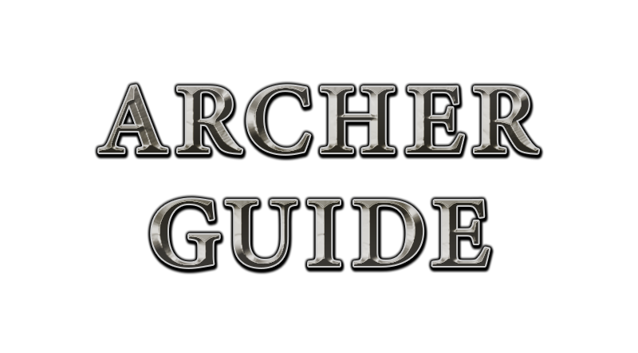

--- 
title: "Archer Guide"
subtitle:
author: "by Turtlebutt and Bunnie"
date: "`r format(Sys.time(), '%d/%m/%Y')`"
site: bookdown::bookdown_site
output: bookdown::gitbook
documentclass: book
bibliography: [latex/book.bib, latex/packages.bib]
biblio-style: apalike
link-citations: yes
github-repo: deynarde/kag-archer-guide
description: "A KAG archer guide for both new and experienced players."
---

# Introduction {-}

  

This guide will help people who are trying to get better at archer. We are going to cover everything -- improving your skill to various levels, every archer trick/move you can do in this game and much more. Archer combat isn't as complex as knight combat and some players consider archer combat much easier to learn. If you want to get better this guide will certainly help you.

> For a tutorial on playing as knight see: [Knight Guide](https://deynarde.github.io/kag-knight-guide/).

> You can contact us on [KAG Discord](https://discord.gg/kag) (`bunnie#8671`, `unit#8073` (Turtlebutt))

> Special thanks to deynarde for setting up the github repository for this
